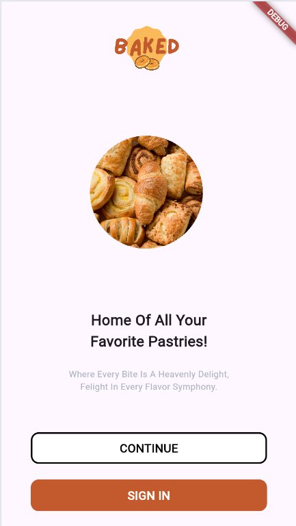

# BakedApps

BakedApps adalah aplikasi mobile menggunakan Flutter yang mempermudah pelanggan untuk memesan makanan tanpa perlu mengantri. Aplikasi ini cocok untuk restoran atau kafe yang ingin meningkatkan efisiensi layanan mereka.

## Fitur Utama

- **Pemesanan Makanan**: Pelanggan dapat memesan makanan langsung dari aplikasi tanpa harus mengantri di kasir.
- **Barcode Pembayaran**: Setelah memilih makanan, pelanggan dapat menggunakan tombol "Payment Now" untuk menghasilkan barcode pembayaran. Barcode ini harus dibawa ke kasir untuk proses pembayaran.
- **Desain User-Friendly**: Antarmuka yang intuitif memungkinkan pelanggan dengan mudah menavigasi dan memesan makanan.

## SnapShoot

  
  
  
  
  
  
  
  
  
  
  
  
  

